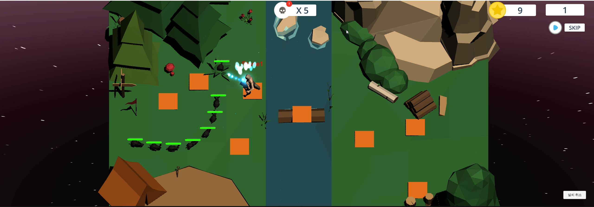

 

# TowerDefence
모바일 환경에서 디펜스 게임에서 투자한 타워가 사라진다면에서 시작한 프로젝트

## 프로젝트 설명

기존 타워 디펜스에 맵을 4분면으로 나뉘어 각 레벨에 도달할 시 한 타일이 사라지며 그 위에 존재하는 타워도 모두 리셋 되어,
지속적인 긴장감을 줄 수 있는 디펜스 게임

* Path는 BezierPath를 이용하여 제작
* 몬스터는 정해진 Path로만 이동하며, 각 몬스터는 HP, Type, Speed의 속성을 가진다.
* 타워는 정해진 Tile 위에서만 제작되며, 각 타워는 업그레이드 가능하다.
* 맵은 시작에 5레벨마다 1개씩 맵이 증가한다.
  * 5레벨에 도달하는 마지막 스테이지 땐 보스가 등장합니다.
* 25레벨부터 발생하는 맵은 왼쪽 상단 맵부터 순서대로 다른 맵으로 교체된다.

---
Nammu - [DreamAntDev](https://github.com/DreamAntDev)  
Email : nammu8395@gmail.com  
GitHub Issue : https://github.com/DreamAntDev/TowerDefense/issues  

---

## 기능 목록
|Icon|설명|
|---|---|
||게임 목숨으로 놓칠 수 있는 몬스터 수입니다.  0이 되면 게임이 종료됩니다.|
||몬스터가 사망 시 코인을 제공합니다.  몬스터마다 제공되는 코인은 다릅니다.|
||현재 스테이지 레벨입니다.|
||타워를 생성할 수 있는 UI를 제공합니다.|
||주황색 타일을 클릭하면 타워를 생성할 수 있습니다.|
||타워를 클릭 시 타워를 업그레이드 할 수 있습니다.|
||5레벨 마다 새로운 맵이 등장합니다. 새로운 맵에도 타워를 설치 할 수 있습니다. 20레벨 이후 원래 생성된 타일이 사라지고 새로운 타일이 생깁니다. 원래 있던 타워는 모두 사라집니다.|

## 라이선스
This library is under the [MIT](https://github.com/DreamAntDev/TowerDefense?tab=MIT-1-ov-file) License.
